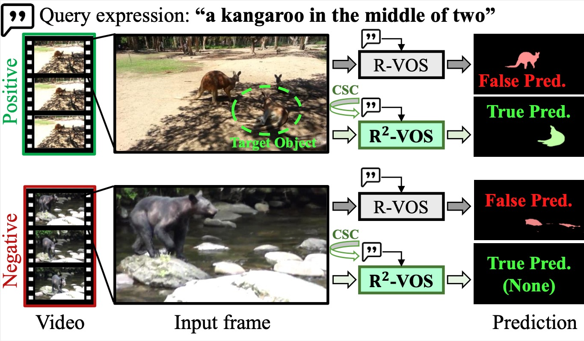

# Abstract
<!--  -->
Referring Video Object Segmentation (R-VOS) is a challenging task that aims to segment an object in a video based on a linguistic expression. Most existing R-VOS methods have a critical assumption: the object referred to must appear in the video. This assumption, which we refer to as "semantic consensus", is often violated in real-world scenarios, where the expression may be queried against false videos. In this work, we highlight the need for a robust R-VOS model that can handle semantic mismatches. Accordingly, we propose an extended task called Robust R-VOS, which accepts unpaired video-text inputs. We tackle this problem by jointly modeling the primary R-VOS problem and its dual (text reconstruction). A structural text-to-text cycle constraint is introduced to discriminate semantic consensus between video-text pairs and impose it in positive pairs, thereby achieving multi-modal alignment from both positive and negative pairs. Our structural constraint effectively addresses the challenge posed by linguistic diversity, overcoming the limitations of previous methods that relied on the point-wise constraint. A new evaluation dataset, R2-YTVOS is constructed to measure the model robustness. Our model achieves state-of-the-art performance on R-VOS benchmarks, Ref-DAVIS17 and Ref-Youtube-VOS, and also our R2-YTVOS dataset.

<p align="center"></p>

> [**Towards Robust Referring Video Object Segmentation with Cyclic Relational Consistency**](https://arxiv.org/abs/2207.01203)
>
> Xiang Li, Jinglu Wang, Xiaohao Xu, Xiao Li, Bhiksha Raj, Yan Lu 

# Updates
- **(2023-05-30)** Code released.
- **(2023-07-13)** R2VOS is accepted to ICCV 2023!

# Install

```
conda install pytorch==1.8.1 torchvision==0.9.1 torchaudio==0.8.1 -c pytorch
pip install -r requirements.txt 
pip install 'git+https://github.com/facebookresearch/fvcore' 
pip install -U 'git+https://github.com/cocodataset/cocoapi.git#subdirectory=PythonAPI'
cd models/ops
python setup.py build install
cd ../..
```

# Docker
You may try [docker](https://hub.docker.com/r/ang9867/refer) to quick start.

# Weights
Please download and put the [checkpoint.pth](https://drive.google.com/file/d/1gknDDMxWKqZ7yPuTh1fome1-Ba4f_G9K/view?usp=share_link) in the main folder.


# Run demo:
Inference on images in the demo/demo_examples.
```
python demo.py --with_box_refine --binary --freeze_text_encoder --output_dir=output/demo --resume=checkpoint.pth --backbone resnet50 --ngpu 1 --use_cycle --mix_query --neg_cls --is_eval --use_cls --demo_exp 'a big track on the road' --demo_path 'demo/demo_examples'
```

## Citation

```
@article{li2022r,
  title={R\^{} 2VOS: Robust Referring Video Object Segmentation via Relational Multimodal Cycle Consistency},
  author={Li, Xiang and Wang, Jinglu and Xu, Xiaohao and Li, Xiao and Lu, Yan and Raj, Bhiksha},
  journal={arXiv preprint arXiv:2207.01203},
  year={2022}
}
```

